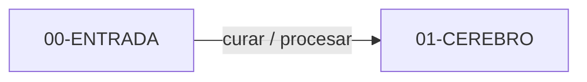

---
tags:
  - meta
  - entrada
  - captura
title: 00-ENTRADA
description: Captura cruda o medio clasificada, aún no curada como nota del cerebro.
created: 2026-10-06
updated: 2026-10-06
---

# 00-ENTRADA

Bandeja de entrada del vault. Aquí cae lo que aún no has curado: dumps, chats, audios, textos y candidatos a medio clasificar. Si ya lo editaste con criterio y lo das por bueno, no pertenece aquí; va a `01-CEREBRO/`.

## Problema

Sin bandeja, la captura acaba mezclada con notas canónicas. Un martes malo tratas un borrador a medias como verdad del vault. Separar "llegó" de "ya lo curé" evita ese lío.

## Alcance

| Incluye | No incluye |
|---------|------------|
| Captura cruda (`audios/`, `chats/`, `texts/`) | Notas curadas del cerebro |
| Candidatos medio clasificados (`sin-procesar/candidatos/`) | Decisiones DEC, proyectos, trackers |
| Material a triar antes de promover | Sustituir `01-CEREBRO/` como almacén permanente |

## Arquitectura

```
00-ENTRADA/
└── sin-procesar/
    ├── audios/
    ├── chats/
    ├── texts/

└── candidatos/     # bandeja de candidatos a medio clasificar

```



## Ejemplo de nota esperada

Candidato en `sin-procesar/candidatos/` (contenido inventado):

```yaml
---
tipo: aprendizaje  # aprendizaje | proceso | identidad | descartar
created: 2026-10-06
title: "El nesting de LXC me devolvió permission denied"
---

# El nesting de LXC me devolvió permission denied

Apunte suelto tras el fallo. Aún no es aprendizaje ni proceso.
```

Tras OK humano, promoción típica: `APRENDIZAJES` / `PROCESOS` / `IDENTIDAD` (o descartar).

## Cómo ejecutarlo

Meter ficheros en la subcarpeta que toque (`audios/`, `chats/`, `texts/`, `candidatos/`).
Triar candidatos a mano: promover a `APRENDIZAJES` / `PROCESOS` / `IDENTIDAD` o descartar.

## Decisiones técnicas

| Elegí | Descarté | Por qué |
|-------|----------|---------|
| Bandeja `sin-procesar/` con subtipos | Un único montón plano | Audios y candidatos no se trian igual |

| `candidatos/` con `tipo` en frontmatter | Inventar carpeta de primer nivel por cada idea | Un contrato mínimo basta para triar |

| Promoción solo tras OK | Auto-mover al cerebro | Una mala clasificación cuesta más que un backlog de entrada |

## Trade-offs y limitaciones

- **Medio clasificado aquí** → la bandeja no está "limpia"; a cambio, no finges que ya es conocimiento curado.

- **Promoción manual** → más fricción al vaciar; a cambio, el cerebro no se ensucia solo.

## Evidencia de calidad

- README de candidatos en `sin-procesar/candidatos/` con contrato `tipo`.
- Queries Dataview del cerebro usan `-#meta`; esta nota lleva `meta`.
- Comprobación: si una nota ya tiene definición estable y enlaces curados, no debería vivir aquí.

## Lecciones aprendidas

- "Medio clasificado" sigue siendo entrada: el listón es curación, no "tiene un tag".

- Documentar la promoción (aprendizaje / proceso / identidad / descartar) evita inventar destinos al triar.

## Próximos pasos

1. Vaciar `candidatos/` con regularidad; no dejar que la bandeja se convierta en almacén.

2. No acumular PDFs de terceros aquí si el destino es `02-RECURSOS/`.
