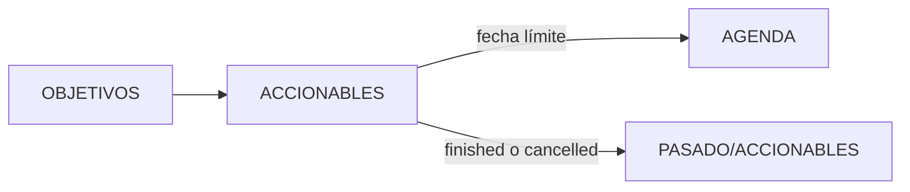

---
tags:
  - meta
  - accionables
  - proyectos
title: ACCIONABLES
description: Proyectos e intención concreta alineada con OBJETIVOS; lo fechado va a AGENDA.
created: 2026-10-06
updated: 2026-10-06
---

# ACCIONABLES

Proyectos (y alguna tarea suelta sin fecha) con intención concreta. Deberían alinearse con `IDENTIDAD/OBJETIVOS/`. Si tiene fecha límite (externa), seguro que pertenece a `AGENDA/`.

El Folder Note [`ACCIONABLES.md`](ACCIONABLES.md) es el mapa de esta carpeta (Dataview por `status`).

## Problema

Meter deadlines dentro del proyecto y focos de semana en el mismo cajón borra la diferencia entre "hacia dónde empujo" y "qué cae el martes". Dataview mira `status` + `rank` aquí; las fechas, en agenda.

## Alcance

| Incluye | No incluye |
|---------|------------|
| Carpetas de proyecto con nota `type: Project` | Eventos y tareas con fecha (`AGENDA/`) |
| Publicaciones en curso *como trabajo del proyecto* (a menudo enlazadas; la instancia fechada vive en agenda) | Objetivos de rumbo sin fecha (`OBJETIVOS/`) |
| Cierre → mover a `PASADO/ACCIONABLES/` | Archivo de journals (`PASADO/REGISTRO/`) |

## Arquitectura

```
ACCIONABLES/
├── ACCIONABLES.md          # Folder Note / mapa de carpeta
├── <Proyecto>/
│   └── <Proyecto>.md       # type: Project; status + rank
└── …                       # series, ofertas, labs bajo el proyecto
```



## Ejemplo de nota esperada

Proyecto tipo:

```yaml
---
created: 2026-10-06
draft: false
rank: 2
status: on
tags:
  - accionables
  - proyecto
title: Lab de backups locales
type: Project
updated: 2026-10-06
---

# Lab de backups locales

Montar prueba de restauración trimestral. Sin fecha en esta nota: los hitos fechados van a AGENDA.
```

Publicación editorial bajo un proyecto usa `edit-phase` (no confundir con `status` de esfuerzo):

```yaml
edit-phase: draft   # planned → outline → draft → in-progress → ready → completed
type: Publication
```

## Cómo ejecutarlo

Revisa el hub [[ACCIONABLES]]: prioriza `on` y `ongoing`. Si tienes más de tres `on`, aparca alguno a `sleeping` antes de abrir otro frente.

Cierre definitivo: mover la carpeta del proyecto a `01-CEREBRO/PASADO/ACCIONABLES/`.

## Decisiones técnicas

| Elegí | Descarté | Por qué |
|-------|----------|---------|
| `status` + `rank` para esfuerzo | Un solo `status` también para editorial | Publicar un post no es aparcar un proyecto |
| `edit-phase` aparte | Reutilizar `status` en publicaciones | Evita estados imposibles ("ongoing" + "ready") |
| Folder Note en la carpeta | Solo mapa en `MAPAS/` | Plugin Folder Note + queries locales |
| Cierre = mover carpeta | Campo `closed:` mágico | Misma idea que archivar trackers |

## Trade-offs y limitaciones

- **Proyectos sin fecha en la nota raíz** → hay que mirar AGENDA para el calendario; a cambio, el proyecto no se pudre de deadlines mezclados.
- **Tareas sueltas aquí** → permitidas si no tienen fecha; en la práctica casi todo fechado acaba en agenda.

## Evidencia de calidad

- Hub Dataview en `ACCIONABLES.md` (On / Ongoing / Sleeping / Cancelled-Finished).

- Contrato de campos abajo (`status` / `rank` / `edit-phase`).

## Campos (contrato)

- Esfuerzo: `status` = `on` → `ongoing` → `sleeping` → `cancelled` / `finished` + `rank`
- Editorial: `edit-phase` = `planned` → `outline` → `draft` → `in-progress` → `ready` → `completed`

## Lecciones aprendidas

- Si todo es `on`, prioriza a mano: el frontmatter no prioriza por ti.

- Alinear con OBJETIVOS es criterio humano; el frontmatter no lo exige, la cabeza sí.

## Próximos pasos

1. Revisar `on` > 3 antes de abrir otro frente.
2. Al terminar un proyecto, mover a `PASADO/ACCIONABLES/` en la misma sesión de cierre.
