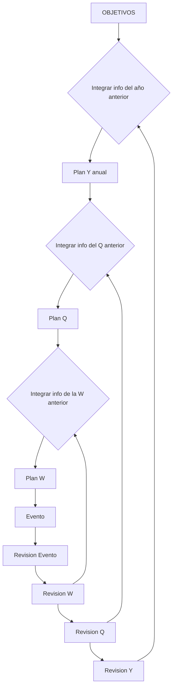

---
tags:
  - meta
  - agenda
  - tiempo
title: AGENDA
description: Weekly/Quarterly/Yearly, eventos Journal y Publication; lo cerrado archiva a REGISTRO.
created: 2026-10-06
updated: 2026-10-07
---

# AGENDA

Tiempo activo: trackers de intervalo (`Weekly` / `Quarterly` / `Yearly`), eventos en los que participas (`Journal`) y comunicaciones fechadas (`Publication`). Los PDFs de salida van a `01-CEREBRO/RECURSOS/publicaciones/`.

Folder Note: [`AGENDA.md`](AGENDA.md).

[`AGENDA-WIDGET.md`](AGENDA-WIDGET.md) embebe la vista "Eventos (en los próximos 7 días)" de `AGENDA.md`: desde hoy, siete días hacia delante. No es el tracker semanal; la ventana rueda con el calendario.

## Problema

Si las fechas viven solo en la cabeza del proyecto, los mapas y el plan de semana no ven el calendario. AGENDA es el sitio donde "cuándo" es dato, no prosa.

## Alcance

| Incluye | No incluye |
|---------|------------|
| `Weekly`, `Quarterly`, `Yearly` | Tracker diario o mensual |
| `Journal` (participas) y `Publication` (asíncrono fechado) | Anécdotas / hitos a posteriori (`Milestone` → REGISTRO) |
| Trackers y eventos futuros | Journals ya archivados (`PASADO/REGISTRO/`) |
| | Objetivos de rumbo sin fecha (`OBJETIVOS/`) |
| | PDFs generados (`RECURSOS/publicaciones/`) |

## Ítems de agenda

### Primera clase

| Ítem | `type` | Rol | Por qué |
|------|--------|-----|---------|
| Evento | `Journal` | Algo en lo que **participas** (reunión, tarea fechada, comida…) | Necesita fecha; no sustituye un tracker |
| Publicación | `Publication` | Comunicación fechada (p. ej. LinkedIn), a menudo asíncrona | Misma agenda por la fecha; no es "estar en la sala" |
| Tracker semanal | `Weekly` | Sprint / tareas del periodo sin fecha concreta por ítem | Sustituye al diario: menos duplicar eventos |
| Tracker cuatrimestral | `Quarterly` | Prioridades reales del tramo | El mensual pierde fuerza; las prioridades viven en Q |
| Tracker anual | `Yearly` | Rumbo del año alineado con OBJETIVOS | Parte el año en cuatrimestres |

### Fuera de primera clase

- **Tracker diario / mensual:** fuera de primera clase. El día = eventos en AGENDA + foco manual.

- **`Anecdote` / `Milestone`:** no se planifican en AGENDA. Anécdota e hito viven en REGISTRO cuando ya sucedieron (el hito lleva `year` + `quarter`).

### Ciclo plan / review



OBJETIVOS alinean el año → el año se parte en Q → el Q en semanas. Cada revisión retroalimenta el mismo nivel y los superiores. Los eventos entran por necesidad de fecha (pueden alinear con el Q, ser imprevistos que cruzan periodos, o ser del periodo).

Estructura de cada tracker: **Índice** (Dataview) → **Plan** (prosa) → **Cierre** (tras review).

## Arquitectura

```
AGENDA/
├── AGENDA.md
├── AGENDA-WIDGET.md
├── 2026/
│   ├── weeklies/2026-Www - Tareas semanales.md   # type: Weekly
│   ├── qs/2026-Qn.md                            # type: Quarterly
│   ├── 2026.md                                  # type: Yearly
│   └── MM/YYYY-MM-DD[ HHMM] - Título.md         # Journal | Publication
├── 2027/
└── …
```

Cierre: mover el tracker a `PASADO/REGISTRO/` (misma ruta relativa). El `type` no cambia.

## Ejemplo de nota esperada

Evento (`Journal`):

```yaml
---
journal-date: 2026-11-06
journal-time: "10:00"
title: 2026-11-06 1000 - Reunión de ejemplo
type: Journal
---
```

Publicación:

```yaml
---
journal-date: 2026-11-06
journal-time: "09:00"
title: BT99 — Ejemplo — ES
type: Publication
---
```

Weekly (campos):

```yaml
---
aliases:
  - 2026-W41
journal-date: 2026-10-11
journal-start-date: 2026-10-05
journal-end-date: 2026-10-11
title: 2026-W41 — Tareas semanales
type: Weekly
year: 2026
quarter: Q4
up:
  - "[[2026-Q4]]"
---
```

Quarterly (plantilla `[[2026-Q4]]`):

```yaml
---
aliases:
  - 2026-Q4
  - Q4 2026
  - plan operativo Q4 2026
journal: Trimestral
journal-date: 2026-10-01
journal-start-date: 2026-10-01
journal-end-date: 2026-12-31
title: Plan operativo 2026-Q4
type: Quarterly
year: 2026
quarter: Q4
up:
  - "[[2026]]"
---
```

Yearly (plantilla `[[2026]]`):

```yaml
---
aliases:
  - "2026"
  - plan 2026
  - plan operativo 2026
journal: Anual
journal-date: 2026-01-01
journal-start-date: 2026-01-01
journal-end-date: 2026-12-31
title: Plan operativo 2026
type: Yearly
year: 2026
---
```

H1 = `title` (Yearly/Quarterly: `# Plan operativo …`). `quarter` / `up` de una semana = cuatrimestre del **jueves** ISO. `year` de Weekly = año ISO. `journal-date` debe caer dentro de `[journal-start-date, journal-end-date]` (la review del lunes siguiente solo toca `updated`). Sin sección `## Enlaces` en Quarterly.

## Cómo ejecutarlo

Crea trackers `Weekly` / `Quarterly` / `Yearly` con la estructura Índice → Plan → Cierre.
Los eventos (`Journal` / `Publication`) van bajo `AGENDA/YYYY/MM/`.
Al cerrar un intervalo, mueve el tracker a `PASADO/REGISTRO/` conservando la ruta relativa.

## Decisiones técnicas

| Elegí | Descarté | Por qué |
|-------|----------|---------|
| Un `Weekly`/`Quarterly`/`Yearly` por intervalo | Tracker diario + journal de cierre paralelo | Menos duplicar; archive mueve el mismo id |
| `Publication` distinto de `Journal` | Todo como evento genérico | Filtrar y gestionar lo asíncrono |

| Un fichero por intervalo (Índice+Plan+Cierre) | Tareas sueltas en path paralelo | Menos duplicar |

| Hitos solo en Índice (Dataview) | Reinyectar Hitos en cada review | Una sola query |

## Trade-offs y limitaciones

- **Jerarquía por año/mes** → más carpetas; a cambio, rutas estables.

- **Archivar a mano** → más fricción; a cambio, cero sorpresas en `PASADO/`.

- **Sin Q1 2026** en el grafo → consciente (periodo personal); no inventar el padre.

## Evidencia de calidad

- Dataview en Índice de cada tracker.
- `AGENDA-WIDGET.md` para embeber 7 días.
- Al archivar, conserva `Weekly` / `Quarterly` / `Yearly`.

## Campos (contrato)

| Tipo | Campos |
|------|--------|
| `Journal` / `Publication` | `journal-date`, opcional `journal-time` |
| `Weekly` | `year`, `quarter` (`Qn`), `up` → Q, bounds |
| `Quarterly` | `title`/`H1` `Plan operativo YYYY-Qn`, `year`, `quarter`, `up` → año, `journal: Trimestral` (para `calendar-nav`); sin sección `## Enlaces` |
| `Yearly` | `title`/`H1` `Plan operativo YYYY`, aliases (`YYYY`, `plan YYYY`, `plan operativo YYYY`), `year`, `journal: Anual`, `journal-date` = 1 ene, tags `anual`/`diario`/`plan`/`plan-anual`/`seguimiento` |

## Lecciones aprendidas

- Tarea con deadline → evento en AGENDA, no bullet eterno en el proyecto.

- El diario como tracker duplicaba eventos; la agenda del día basta.

## Próximos pasos

1. Plan/review sobre el mismo fichero del intervalo (no duplicar en chats).

2. Enlazar publicaciones a su PDF en `RECURSOS/publicaciones/` sin mover el Markdown aquí.
