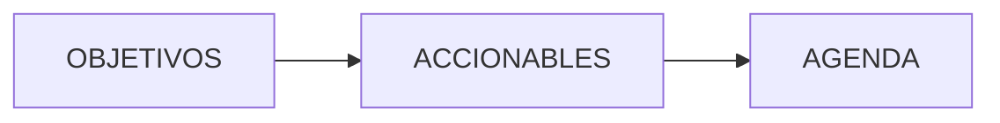

---
tags:
  - meta
  - identidad
  - objetivos
title: OBJETIVOS
description: Rumbo a largo plazo sin fecha; los accionables se alinean con esto, la agenda pone deadlines.
created: 2026-10-06
updated: 2026-10-06
---

# OBJETIVOS

Objetivos a largo plazo **sin fecha**: marcan rumbo (p. ej. jubilarte con un colchón que genere 3K/mes). No son proyectos (ACCIONABLES) ni tareas con deadline (AGENDA).

La carpeta puede estar vacía; el rol sigue siendo ese.

## Problema

Si el rumbo solo vive en la cabeza, cada semana inventa prioridades. Si metes el rumbo en AGENDA, le exiges fecha y lo conviertes en tarea. OBJETIVOS evita ambas trampas.

## Alcance

| Incluye | No incluye |
|---------|------------|
| Rumbo largo plazo sin deadline | Proyectos con intención concreta (`ACCIONABLES/`) |
| Criterio para alinear esfuerzos | Eventos/tareas fechadas (`AGENDA/`) |
| Notas estables de "hacia dónde" | DEC puntuales (`DECISIONES/`) |

## Arquitectura

Notas planas en esta carpeta. Sin subtaxonomía fija todavía.

```
OBJETIVOS/
└── <objetivo de rumbo>.md
```

Cadena mental:



## Ejemplo de nota esperada

Inventada (cifras de ilustración, no un plan financiero real del vault):

```yaml
---
created: 2026-10-06
draft: false
tags:
  - identidad
  - objetivos
title: Colchón pasivo que cubra 3K al mes
type: Goal
up:
  - "[[OBJETIVOS]]"
updated: 2026-10-06
---

# Colchón pasivo que cubra 3K al mes

Rumbo. Sin fecha en esta nota. Los proyectos que empujen hacia aquí viven en ACCIONABLES; los hitos fechados, en AGENDA.
```

## Cómo ejecutarlo

1. Escribe el rumbo cuando lo firmes de verdad (no un wishlist de 40 bullets).
2. Al priorizar ACCIONABLES, mira si empuja algún OBJETIVO.
3. No clones el objetivo como evento "para 2035" solo por ansiedad de fecha.

## Decisiones técnicas

| Elegí | Descarté | Por qué |
|-------|----------|---------|
| Sin fecha aquí | Meter rumbo en trackers anuales solo | El año es calendario; el rumbo lo atraviesa |
| Separado de ACCIONABLES | "Todo es proyecto" | Un proyecto se cierra; un rumbo permanece |

## Trade-offs y limitaciones

- **Carpeta vacía** → el sistema no te castiga; tú sí notas la falta al priorizar.
- **`type: Goal`** — homogeniza cuando existan notas reales.

## Evidencia de calidad

- Cadena documentada en READMEs de ACCIONABLES/AGENDA.
- Esta nota `#meta` no aparece en Dataview de contenido.

## Lecciones aprendidas

- Un objetivo con fecha límite dejó de ser rumbo: es agenda (o proyecto con hito).
- Pocos objetivos buenos ganan a una lista que compite consigo misma.

## Próximos pasos

1. Bajar 1–3 rumbos reales cuando quieras anclar el portfolio.
2. Revisarlos en review de Q/año, no cada lunes.
